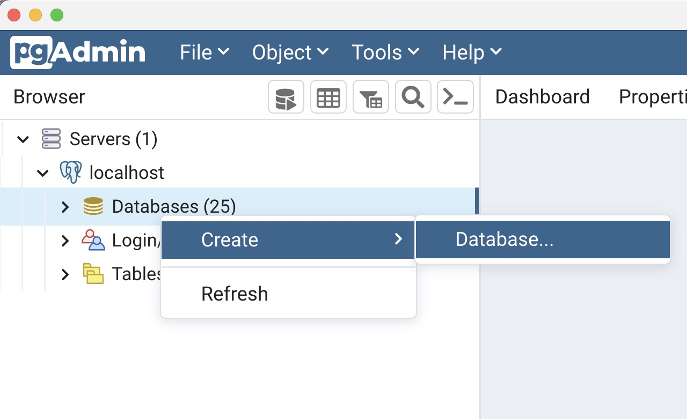

## Introdução

 PostGIS é a extensão espacial do Banco de Dados PostgreSQL que adiciona “capacidades espaciais” ao mesmo, permitindo que esse se torne um repositório de dados para os Sistemas de Informações Geográficas (SIG).

 Isso ocorre nos mesmos moldes
de soluções proprietárias como o SDE - Spatial Database Engine da ESRI® a extensão Spatial da Oracle® e o Spatial Extender do DB2 da IBM®.

No PostGIS está incluso suporte para todas as funcionalidades e objetos definidos na especificação *"Simple Features for SQL"* (SFSQL) do padrão OpenGIS® (Open Geospatial Consortium - OGC).

Nele são definidos funções que permitem consultas e manipulações de dados espaciais
através de comandos SQL no PostgreSQL.
Devido à sua aderência pelo formato SFSQL, o PostGIS torna-se uma ferramenta confiável
por usar funções padronizadas e abertas ao manipular os dados espaciais. Com isso muitas aplicações (Mapserver, ArcGIS, QGIS, GeoServer, etc.) podem lidar com o PostGIS e acessar/manipular seus
dados.


## Instalação

<div align="center">

[](http://www.youtube.com/watch?v=WCjLr1YVJ1s "Como instalar PostgreSQL com PostGIS no Windows")

Como instalar PostgreSQL com PostGIS no Windows | Leandro França - GeoOne

</div>


## Criando um Banco de Dados Geográficos

### Através de linha de comando:

```shell
# Criando o Banco de Dados
createdb gis
# Acessando o Banco de Dados
psql gis

# Habilitando a extensão:
CREATE EXTENSION postgis;

# Saindo do Banco de Dados
\q
```


### Através do PgAdmin

Clique com o botão direito em `Databases` e escolha `Create` >  `Database:





Preencha o nome do BDG, no caso do exemplo abaixo, `gis`:


Em seguida, clique no botão `Query Tool` e execute a query abaixo:


Volte para a janela principal do PGAdmin e verifique se foram criados os seguintes elementos:

- Aggregates (18)
- Functions (695)
- Operators (51)
- Tables (1)
- Trigger Functions (2)
- Types (9)
- Views (2)

Como mostra a figura abaixo:


<div align="center">

<hr>

[](http://www.youtube.com/watch?v=8WDP_aKnFSU) 

Create a Spatial Database | PostGIS Baby Steps - The Geospatials

</div>


<hr>

## Exercício:

1. Crie um Banco de Dados Geográficos seguindo os passos anteriores com o nome `pb`.