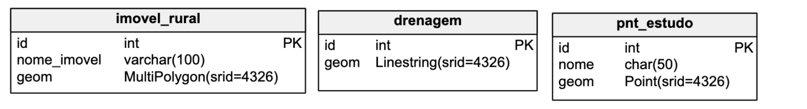

## 3 - Criação de Tabelas Espaciais

A criação de tabelas com o PostGIS, pode ser feita de duas formas, sendo exemplificadas a seguir:

* Criando a coluna com o tipo de geometria **após** a criação da tabela, com o comando `AddGeometryColumn`:


```sql
CREATE TABLE pontos (
	id serial PRIMARY KEY
);
SELECT AddGeometryColumn('public', 'pontos', 'geom', 4326, 'POINT', 2);
```

Os parâmetros do comando `AddGeometryColumn` são:

```sql
SELECT AddGeometryColumn(
	'esquema', -- esquema do banco de dados onde foi criada a tabela
	'nome_da_tabela', -- nome da tabela onde será adicionada a coluna
	'nome_da_coluna', -- nome da coluna espacial
	srid, -- Sistema de Refeência dos Dados
	'tipo_geometria', -- Tipo de Geometria: POINT, POLYGON, LINESTRING, etc.
	dimensao -- 2 para 2D ou 3 para 3D
);
```


* Ou, informando diretamente o tipo de geometria na instrução SQL do `CREATE`:

```sql
CREATE TABLE pontos (
	id serial PRIMARY KEY,
	geom geometry(POINT, 4326)
);
-- Necessário para garantir a integridade dos dados espaciais da tabela
SELECT Populate_Geometry_Columns('public.pontos'::regclass);
```

Recomenda-se rodar o comando `Populate_Geometry_Columns` para que a tabela seja registrada de forma correta na **view** de metadados `geometry_columns` e que também sejam criadas as `constraints` a seguir:

* `enforce_dims_geom`: garante que cada geometria tenha a mesma dimensão;

* `enforce_geotype_geom`: garante que cada geometria seja do mesmo tipo;

* `enforce_srid_geom`: garante que cada geometria esteja no mesmo sistema de referência (SRID).

### Tabela `spatial_ref_sys` e View `geometry_columns`:


Em conformidade com a especificação *Simple Features for SQL (SFSQL)*, o PostGIS fornece uma tabela (`spatial_ref_sys`) e uma *view* para rastrear e relatar os tipos de geometria disponíveis em um determinado banco de dados.

A tabela, `spatial_ref_sys`, define todos os Sistemas de Referência, e estes podem ser identificados através de um código chamado *Spatial Reference System Identifier - SRID*.

Toda geometria armazenada no PostGIS possui um identificador de referência espacial ou "SRID".

Os valores de SRID ≠ -1 indicam que os dados estão associados a um sistema de referência.

Para encontrar maiores detalhes sobre SRID, acesse o site: http://spatialreference.org/.

Alguns Exemplos de SRID:

- SIRGAS2000 LAT / LONG = 4674
- WGS-84 LAT / LONG = 4326
- SIRGAS / UTM zone 24S = 31984
- SIRGAS / UTM zone 25S = 31985

Já a *view* `geometry_columns` fornece uma listagem de todas as tabelas espaciais registradas e informações básicas sobre as mesmas.


### Tipos de Geometria


#### Representação de geometrias no formato Well-known text (WKT)

```
POINT(0 0)
LINESTRING(0 0,1 1,1 2)
POLYGON((0 0,4 0,4 4,0 4,0 0),(1 1, 2 1, 2 2, 1 2,1 1))
MULTIPOINT((0 0),(1 2))
MULTILINESTRING((0 0,1 1,1 2),(2 3,3 2,5 4))
MULTIPOLYGON(((0 0,4 0,4 4,0 4,0 0),(1 1,2 1,2 2,1 2,1 1)),((-1 -1,-1 -2,-2 -2,-2 -1,-1 -1)))
GEOMETRYCOLLECTION(POINT(2 3),LINESTRING(2 3,3 4))
```
### Exemplos:

#### Crie as tabelas a seguir:


```sql
CREATE TABLE pnt_interesse (
    id serial PRIMARY KEY,
    nome varchar(100),
    dt_coleta date
);
SELECT AddGeometryColumn('public', 'pnt_interesse', 'geom', 4326, 'POINT', 2);

-- **************************************************************************** --

CREATE TABLE adutora (
    id serial PRIMARY KEY,
    descricao varchar(50)
);
SELECT AddGeometryColumn('public', 'adutora', 'geom', 4326, 'LINESTRING', 2);

-- **************************************************************************** --

CREATE TABLE area_estudo (
    id serial PRIMARY KEY,
    nome varchar(50)
);
SELECT AddGeometryColumn('public', 'area_estudo', 'geom', 4326, 'POLYGON', 2);

```

### Exercícios:

1. Crie as tabelas a seguir:




