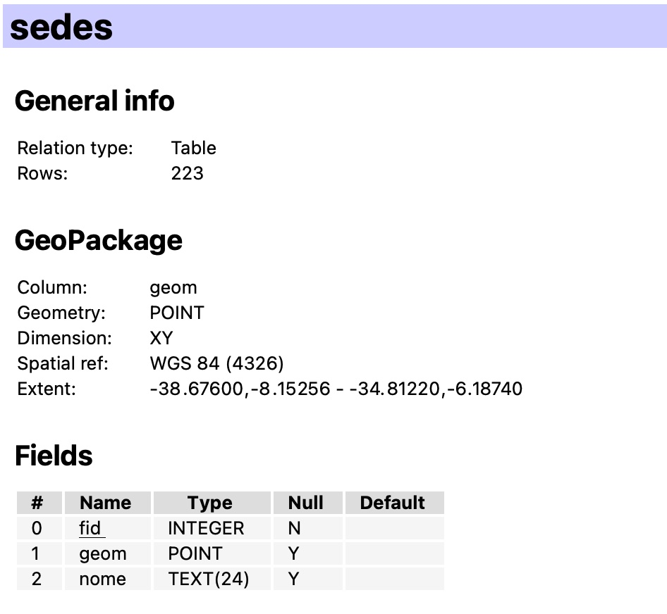

## 3 - Dados do Curso

Os dados espaciais deste curso estão armazenados no formato `GeoPackage` e o link para download se encontra abaixo:

https://drive.google.com/file/d/1uBAsmt7UW6enTe4miAxVLK5U98BkvCi4/view?usp=share_link

OBS: É necessário estar logado na sua conta do IFPB para ter acesso.

Fonte: IBGE (2010)

Fonte: IBGE (2018)

Fonte: IBGE (2021)

Fonte: IBGE (2021)

Fonte: DER-PB (2019)

Fonte: IBGE (2021)

Fonte: CPRM (2020)

Fonte: IBGE (2021)

