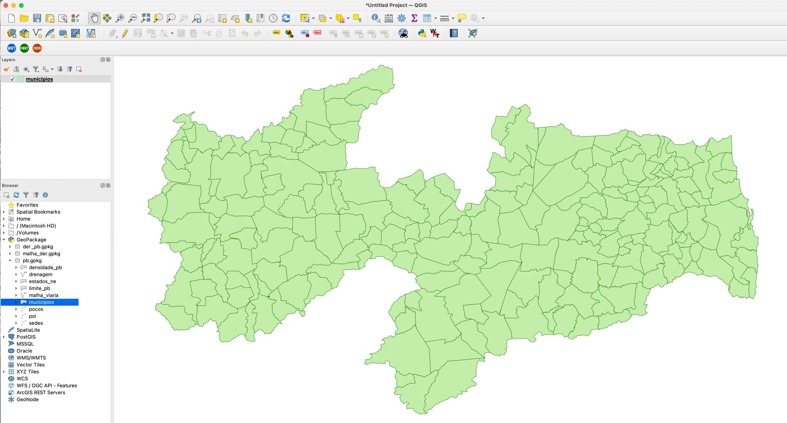
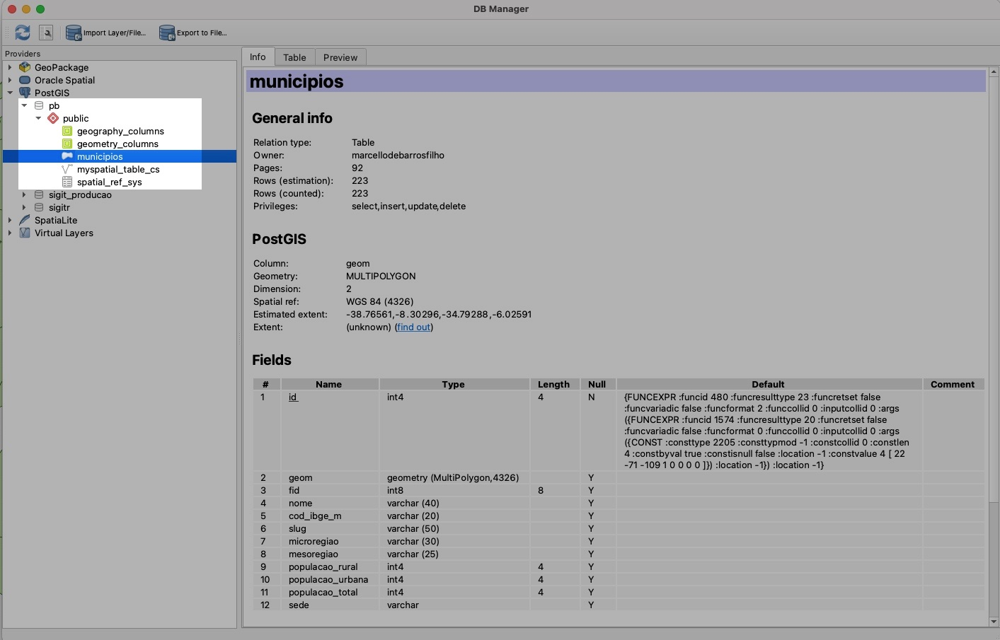

## 5. Importação de Dados Espaciais

### Convertendo Dados no Formato GeoPackage (e shapefile) com o QGIS

1. Com o QGIS aberto, conecte o GeoPackage `pb` com o QGIS, através do clique com o botão direito no mouse em `GeoPackage`, como mostra figura a figura abaixo:


2. Adicione as camadas que deseja importar ao seu banco no QGIS, neste exemplo, foi adicionada a camada `municipios`:



3. Habilite a extensão `DB Manager` no menu `Plugins`, na opção `Manage and Install Plugins...`:


4. Crie uma conexão com o seu banco de dados, clicando com o botão direito do mouse no ícone do PostGIS, no painel `Browser`:


5. Preencha os parâmetros de conexão, como mostra a figura abaixo:


6. Abra o `DB Manager`, clique em `Import Layer/File` e Preencha o formulário de importação, como mostra a figura abaixo:


7. Atualize o Banco de Dados e verifique o resultado. A tabela `municipios` aparecerá no esquema `public`.



**OBS:** Este processo pode ser realizado de forma semelhante pata importar arquivos nos formato `shapefile`

### Conversão de arquivos shapefile através do comando `shp2pgsql`

O comando shp2pgsql permite a conversão de shapefiles em arquivos SQL, sua sintaxe básica é a seguinte:

```bash
shp2pgsql -s <SRID> -W <encoding> <caminho-do-shapefile> <nome-da-tabela> > <arquivo_sql_gerado.sql>
```

Exemplo (Windows):

```bash
C:\Arquivos de programas\PostgreSQL\9.5\bin\shp2pgsql.exe 
-s 4674 
–W "LATIN1"
C:\temp\municipios_base.shp
municipios > 
C:\temp\municipios.sql
```

Uma vez criado o arquivo `.sql`, basta carregá-lo no PGAdmin, QGIS ou via terminal, com o comando `psql`. 


### Convertendo Dados no Formato GeoPackage (e shapefile) com o QGIS - Passo a Passo em Vídeo

<div align="center">

[](http://www.youtube.com/watch?v=6WQRTcFF5kg "Como instalar PostgreSQL com PostGIS no Windows")

Conversão de camadas no formato GeoPackage em tabelas PostGIS | Prof. Marcello Benigno

</div>


### Exercício:

1. Importe todas as camadas do GeoPackage deste [link](https://drive.google.com/file/d/1uBAsmt7UW6enTe4miAxVLK5U98BkvCi4/view?usp=share_link), para o BDG `pb`. Para baixar os dados, é necessário que você esteja logado na sua conta do IFPB.
