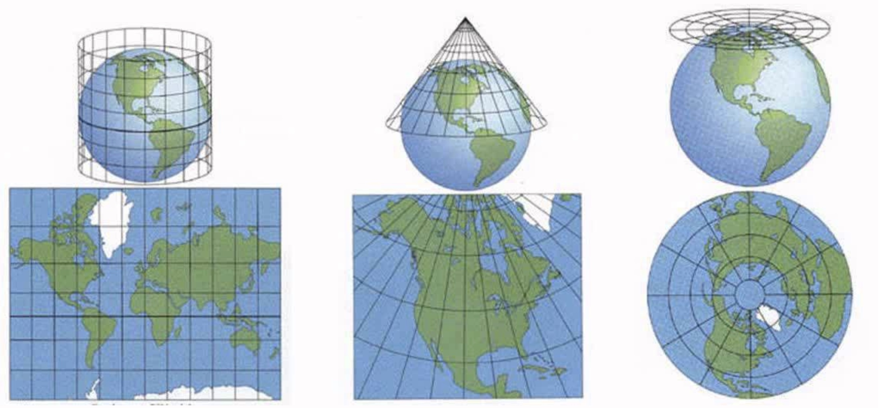
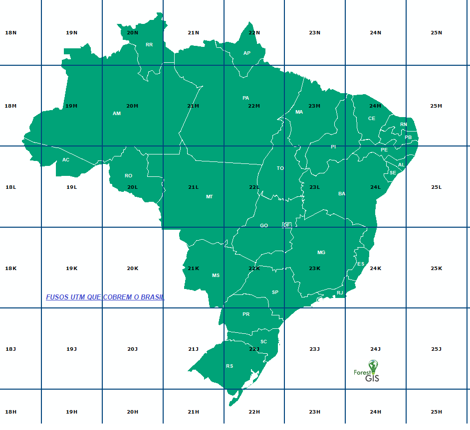

## 6. Trabalhando com Projeções

   

A função [`ST_Transform`](https://postgis.net/docs/ST_Transform.html) reprojeta os dados de um determinado [**SRID**](https://en.wikipedia.org/wiki/Spatial_reference_system) para outro, alguns exemplos de uso:

1. Exibir as coordenadas da sede de João Pessoa em coordenadas geográficas e em UTM.

**Obs:** João Pessoa está no fuso UTM 25 Sul ([SRID=31985](https://spatialreference.org/ref/epsg/31985/))

  

```sql
SELECT ST_X(geom) AS longitude,
       ST_Y(geom) AS latitude,
       -- utilizando a função ST_transform:
       ST_X(ST_Transform(geom, 31985)) AS este,
       ST_Y(ST_Transform(geom, 31985)) AS norte
FROM sedes
WHERE nome = 'João Pessoa';
```

```
longitude            |      latitude      |       este        |       norte
---------------------+--------------------+-------------------+-------------------
 -34.824651912797535 | -7.153792036382988 | 298498.7976416113 | 9208850.233116478

```

2. Converter o o polígono do município de **Patos** para UTM ([SRID=31984](https://spatialreference.org/ref/epsg/31984/))


```sql
SELECT id,
       nome,
       ST_Transform(geom, 31984) AS geom
FROM municipios
WHERE nome = 'Patos';
```

```
id  |  nome | geom
----+---------------------------------------------------------------------------------------------------
185 | Patos | 0106000020F07C000001000000010300000001000000390100007C42BE3E136B2541F646BE51C6996141AB...
```

OBS: Nos casos onde as feições encontram-se entre dois fusos UTM, o ideal é utilizar outra projeção, a exemplo da *[SIRGAS 2000 / Brazil Polyconic](https://epsg.io/5880)*


3. Exibir o polígono município de **Campina Grande** em WKT, com a função [ST_AsText](https://postgis.net/docs/ST_AsText.html) na projeção *SIRGAS 2000 / Brazil Polyconic* ([SRID=5880](https://epsg.io/5880)):

```sql
SELECT id,
       nome,
       ST_AsText(ST_Transform(geom, 5880)) AS geom
FROM municipios
WHERE nome = 'Campina Grande';
```

```
id  |  nome | geom
----+------------------------------------------------------------------------------------------------------------------------
185 | Patos | MULTIPOLYGON(((6984415.880751882 9168813.491909271,6984617.081563575,...,6984415.880751882 9168813.491909271)))

