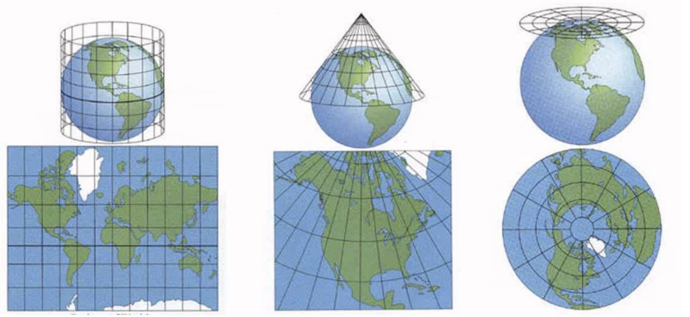
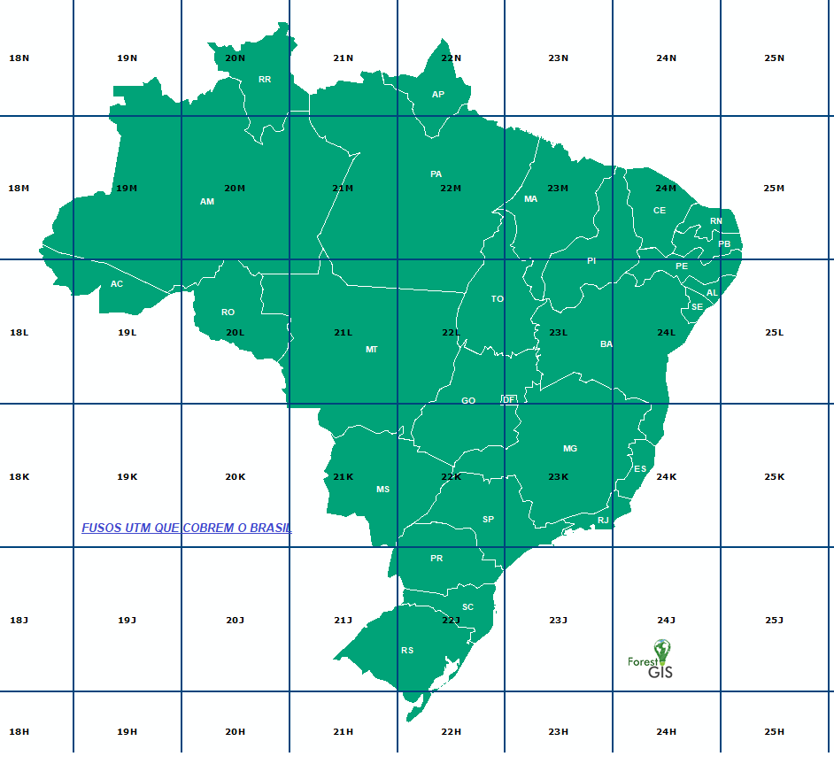

## 6. Trabalhando com Projeções

## Introdução

As projeções cartográficas são representações matemáticas que transformam a superfície curva da Terra em um plano bidimensional. Cada projeção possui características específicas e é adequada para diferentes propósitos: algumas preservam áreas, outras preservam ângulos ou distâncias.

No PostGIS, trabalhamos com diferentes **Sistemas de Referência Espacial (SRS)**, identificados por um código SRID (*Spatial Reference System Identifier*). Os dois principais tipos são:

- **Coordenadas Geográficas** (latitude/longitude): expressas em graus, usam o elipsoide terrestre como referência (ex: SRID 4674 - SIRGAS 2000)
- **Coordenadas Projetadas**: expressas em metros, resultam da projeção do elipsoide em um plano (ex: UTM, Policônica)

### Por que reprojetar dados?

- **Cálculos de distância e área**: coordenadas geográficas em graus não permitem medições precisas em metros
- **Análises espaciais**: muitas operações exigem dados em sistemas de coordenadas projetadas
- **Compatibilidade**: integrar dados de diferentes fontes que usam projeções distintas
- **Visualização**: diferentes escalas e regiões demandam projeções específicas

   

A função [`ST_Transform`](https://postgis.net/docs/ST_Transform.html) é utilizada para reprojetar geometrias de um SRID para outro:

```sql
ST_Transform(geometry, target_srid)
```

**Parâmetros:**
- `geometry`: a geometria a ser reprojetada
- `target_srid`: o código SRID do sistema de destino

## Exemplos Práticos

### Exemplo 1: Coordenadas da Sede de João Pessoa

João Pessoa está localizada no **fuso UTM 25 Sul** ([SRID=31985](https://spatialreference.org/ref/epsg/31985/)). Vamos exibir suas coordenadas tanto em graus (geográficas) quanto em metros (UTM):

  

```sql
SELECT ST_X(geom) AS longitude,
       ST_Y(geom) AS latitude,
       -- utilizando a função ST_transform:
       ST_X(ST_Transform(geom, 31985)) AS este,
       ST_Y(ST_Transform(geom, 31985)) AS norte
FROM sedes
WHERE nome = 'João Pessoa';
```

```
longitude            |      latitude      |       este        |       norte
---------------------+--------------------+-------------------+-------------------
 -34.824651912797535 | -7.153792036382988 | 298498.7976416113 | 9208850.233116478

```
### Exemplo 2: Município de Patos em UTM

Converter o o polígono do município de **Patos** para UTM ([SRID=31984](https://spatialreference.org/ref/epsg/31984/))


```sql
SELECT id,
       nome,
       ST_Transform(geom, 31984) AS geom
FROM municipios
WHERE nome = 'Patos';
```

```
id  |  nome | geom
----+---------------------------------------------------------------------------------------------------
185 | Patos | 0106000020F07C000001000000010300000001000000390100007C42BE3E136B2541F646BE51C6996141AB...
```
**⚠️ Importante:** Quando uma feição se estende por dois fusos UTM adjacentes, a projeção UTM pode causar distorções significativas. Nesses casos, recomenda-se usar a projeção **SIRGAS 2000 / Brazil Polyconic** (SRID=5880), que foi desenvolvida especialmente para cobrir todo o território brasileiro com menor distorção.

### Exemplo 3: Campina Grande em Policônica

Exibir o polígono município de **Campina Grande** em WKT, com a função [ST_AsText](https://postgis.net/docs/ST_AsText.html) na projeção *SIRGAS 2000 / Brazil Polyconic* ([SRID=5880](https://epsg.io/5880)):

```sql
SELECT id,
       nome,
       ST_AsText(ST_Transform(geom, 5880)) AS geom
FROM municipios
WHERE nome = 'Campina Grande';
```

```
id  |  nome | geom
----+------------------------------------------------------------------------------------------------------------------------
185 | Patos | MULTIPOLYGON(((6984415.880751882 9168813.491909271,6984617.081563575,...,6984415.880751882 9168813.491909271)))

```

## Comparação de Projeções

### Quando usar cada projeção?

| Projeção | SRID | Uso Recomendado | Observações |
|----------|------|-----------------|-------------|
| **SIRGAS 2000 Geográfica** | 4674 | Armazenamento geral, GPS | Coordenadas em graus |
| **UTM Zona 24S** | 31984 | Análises locais no oeste da PB | Preserva distâncias localmente |
| **UTM Zona 25S** | 31985 | Análises locais no leste da PB | Preserva distâncias localmente |
| **Brazil Polyconic** | 5880 | Mapas estaduais/regionais | Menor distorção para o Brasil |


## Exercícios

### 1. Sede de Cabedelo em UTM
Exiba a geometria da sede de **Cabedelo** em formato WKT, reprojetando os dados para UTM Zona 25S (SRID=31985).

**Dica:** Combine `ST_AsText` com `ST_Transform`.

---

### 2. Rodovia PB-195 em UTM
Exiba a geometria do trecho **PB-195/0010** em WKT, reprojetando os dados para UTM Zona 24S (SRID=31984).

---

### 3. Criar Tabela com Nova Projeção
Crie uma nova tabela chamada `municipios_5880` contendo todos os municípios reprojetados para *SIRGAS 2000 / Brazil Polyconic* (SRID=5880).

**Dica:** Utilize a sintaxe:
```sql
CREATE TABLE municipios_5880 AS 
SELECT id, nome, ST_Transform(geom, 5880) AS geom
FROM municipios;
```

Não esqueça de atualizar os metadados espaciais e criar índices espaciais na nova tabela!

---

### 4. Poços em Santa Rita
A partir da tabela `pocos`, realize uma consulta que mostre os dados do município de **Santa Rita** com as seguintes colunas:

- `id`
- `proprietar` (proprietário)
- `long` (longitude original)
- `lat` (latitude original)
- `x` (coordenada Este em UTM)
- `y` (coordenada Norte em UTM)

**Resultado esperado:**
```
  id  |             proprietar             |       long        |        lat        |         x          |         y
------+------------------------------------+-------------------+-------------------+--------------------+-------------------
 1793 | Prefeitura Municipal De Santa Rita | -34.9743701325759 | -7.12963082107352 |  281947.4151248357 |  9211454.42324967
 1796 | Prefeitura Municipal De Santa Rita | -34.9758701428972 | -7.12485300395984 |  281779.4253809983 |  9211982.194475273
 ...
```

**Dica:** Santa Rita também está no fuso 25S (SRID=31985).

---

### 5. Sedes do Fuso 25 Sul em UTM
Converta todas as geometrias das sedes que estão no **fuso 25 Sul** para UTM - SIRGAS 2000 (SRID=31985).

**Desafio adicional:** Crie uma coluna indicando se a conversão foi aplicada ou não, e salve o resultado em uma nova tabela.

**Dica:** Municípios do fuso 25S geralmente têm longitude > -36°.

---

## Recursos Adicionais

- **Documentação PostGIS:** https://postgis.net/docs/reference.html#Spatial_Reference_System_Functions
- **Catálogo EPSG:** https://epsg.io/ (busque SRIDs por região ou nome)
- **Spatial Reference:** https://spatialreference.org/ (informações detalhadas sobre projeções)

**💡 Dica Final:** Sempre verifique o SRID dos seus dados antes de realizar análises espaciais usando `SELECT ST_SRID(geom) FROM tabela LIMIT 1`.
