## 8. Relacionamentos Espaciais

Uma das características mais relevantes dos Bancos de Dados Geográficos, é a capacidade de comparar as relações espaciais entre as geometrias. Neste tópico iremos explorar alguns exemplos utilizando as funções topológicas mais usuais.


### [ST_Equals](https://postgis.net/docs/ST_Equals.html)

Testa se duas geometrias são iguais:

<div align=center>
	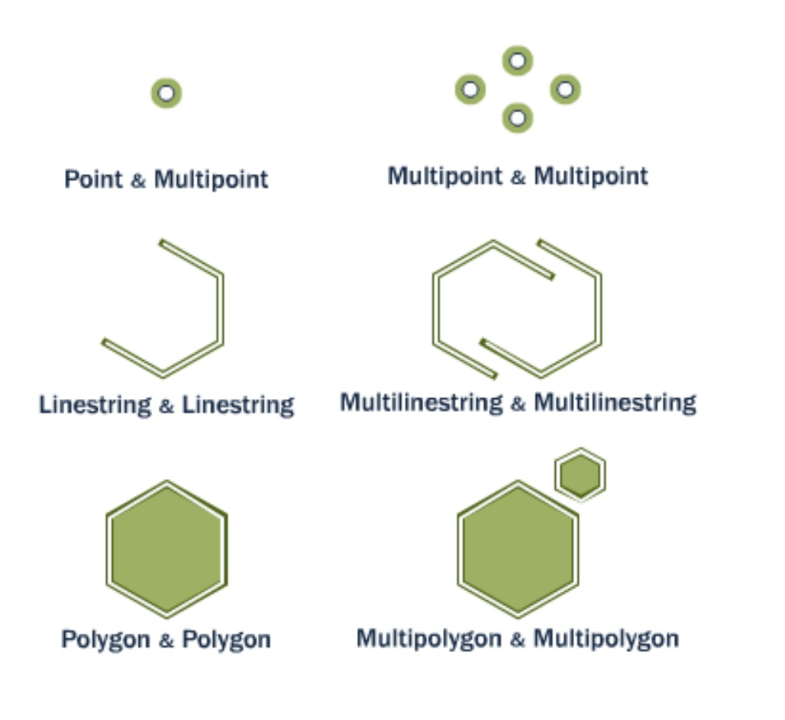
</div>


```sql
/* Qual é a sede que possui a geometria igual ao ponto com
coordenadas x=-37.958771071678186 e y=-7.014295589558234 */
SELECT nome, ST_Astext(geom)
FROM sedes
WHERE ST_Equals(geom, ST_GeomFromText('POINT(-37.958771071678186 -7.014295589558234)', 4326));
```

```
  nome   |                   st_astext
---------+-----------------------------------------------
 Coremas | POINT(-37.958771071678186 -7.014295589558234)
```

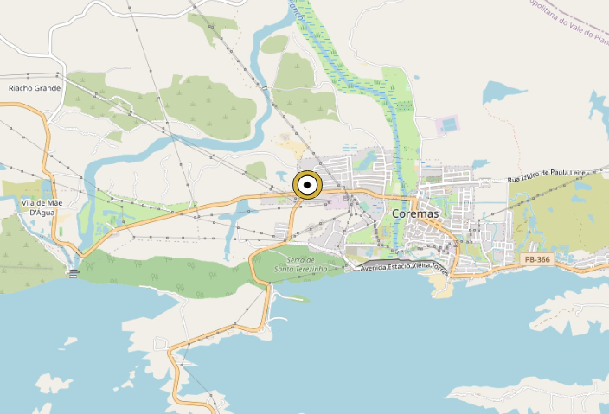


### [ST_Intersects](https://postgis.net/docs/ST_Intersects.html)

Compara duas geometrias e retorna verdadeiro se elas se intersectarem (se tiverem algum ponto em comum):

<div align=center>
	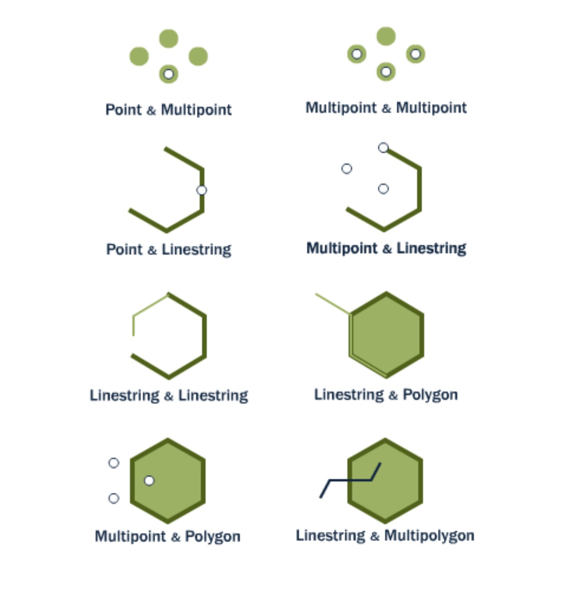
</div>

```sql
-- Quais são os trechos de rodovias que intersectam o município de Guarabira?
SELECT a.rodovia_nome, a.codigo
FROM malha_viaria a,
     municipios b
WHERE ST_Intersects(a.geom, b.geom)
  AND b.nome = 'Guarabira'
ORDER BY codigo;
```

```
 rodovia_nome |      codigo
--------------+-------------------
 Acesso       | AC1/PB-057/PB-073
 Acesso       | AC1/PB-073
 PB-057       | PB-057/0030
 PB-057       | PB-057/0040
 PB-073       | PB-073/0040
 PB-073       | PB-073/0050
 PB-073       | PB-073/0060
 PB-075       | PB-075/0030
```

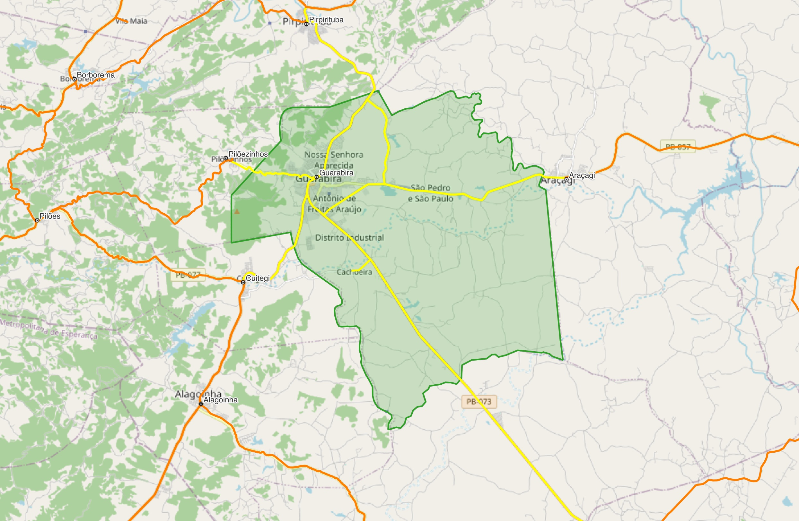


### [ST_Disjoint](https://postgis.net/docs/ST_Disjoint.html)

É o oposto da função `ST_Intersects`, `ST_Disjoint`` verifica se duas geometrias são disjuntas, ou seja, não possuem nenhum ponto em comum:

<div align=center>
	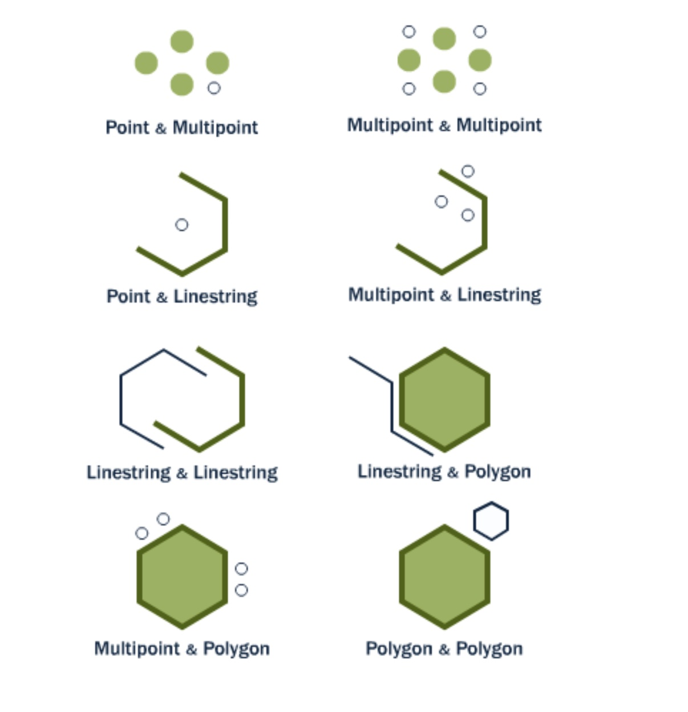
</div>


```sql
-- Quais são os municípios que não fazem fronteira com o município de Taperoá?
SELECT a.id, a.nome
FROM municipios a,
     municipios b
WHERE ST_Disjoint(a.geom, b.geom)
  AND b.nome = 'Taperoá';
```

```
 id  |              nome
-----+--------------------------------
   1 | Baraúna
   2 | Barra de Santana
   3 | Bayeux
   4 | Boqueirão
   5 | Campina Grande
   6 | Itabaiana
   ... ...
```


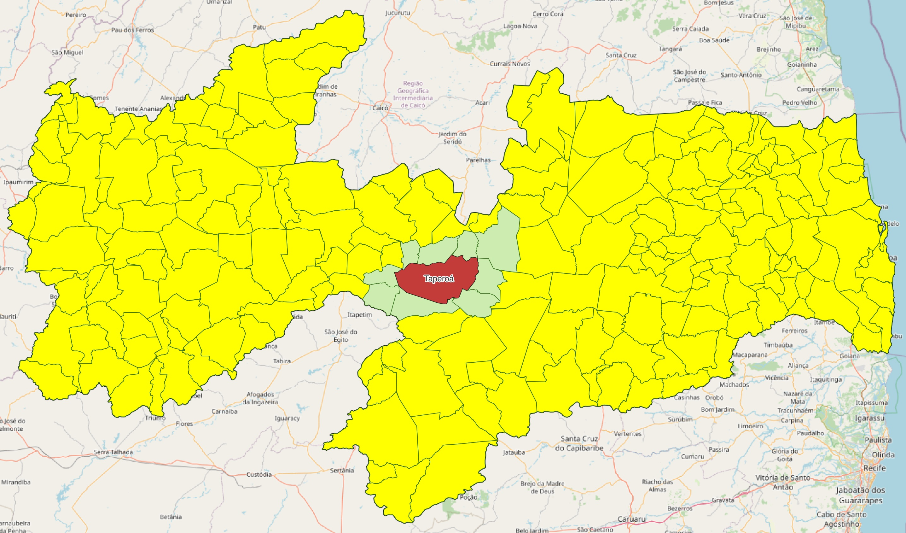


### [ST_Crosses](https://postgis.net/docs/ST_Crosses.html)

Compara duas geometria e retorna verdadeiro se sua interseção "cruzar espacialmente" a outra, ou seja, as geometrias possuem alguns, mas não todos os pontos internos em comum. A interseção dos interiores das geometrias não deve ser vazia e deve ter dimensão menor que a dimensão máxima das duas geometrias de entrada. Além disso, a interseção das duas geometrias não deve ser igual a nenhuma das geometrias de origem. Caso contrário, ele retorna falso.

<div align=center>
  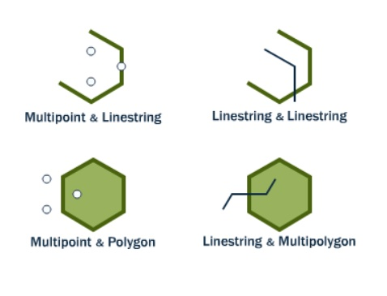
</div>

```sql
/* Quais são os municípios que são cortados pela BR-230 e
   a quantidade de trechos dessa rodovia por município? */
SELECT a.nome, b.rodovia_nome, COUNT(b.codigo) AS qtde_trechos
FROM municipios a,
     malha_viaria b
WHERE ST_Crosses(b.geom, a.geom)
  AND b.rodovia_nome = 'BR-230'
GROUP BY b.rodovia_nome, a.nome
ORDER BY a.nome;
```

```
           nome           | rodovia_nome | qtde_trechos
--------------------------+--------------+--------------
 Aparecida                | BR-230       |            2
 Assunção                 | BR-230       |            1
 Boa Vista                | BR-230       |            1
 Bom Jesus                | BR-230       |            2
 Cabedelo                 | BR-230       |            1
 Cachoeira dos Índios     | BR-230       |            3
 ...                        ...                     ...
```

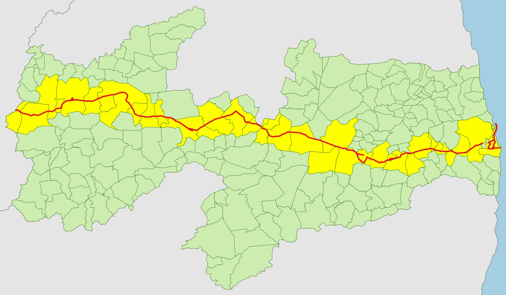

### [ST_Overlaps](https://postgis.net/docs/ST_Overlaps.html)

Retorna verdadeiro se as geometrias A e B possuírem uma sobreposição entre seus vértices.

<div align=center>
  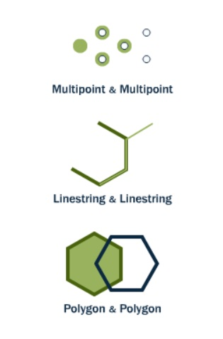
</div>

```sql
-- Quais são os trechos de rodovia que estão se sobrepondo?
SELECT a.id, a.codigo
FROM malha_viaria a,
     malha_viaria b
WHERE ST_Overlaps(a.geom, b.geom)
  AND a.id <> b.id;
```

```
 id  |   codigo
-----+-------------
  25 | BR-412/0050
 252 | PB-085/0070
 263 | PB-008/0040
 266 | AC0/PB-323
 349 | PB-148/0060
 403 | PB-069/0030
 529 | PB-018/0030
 561 | PB-323/0040
 561 | PB-323/0040
 625 | PB-325/0060
```

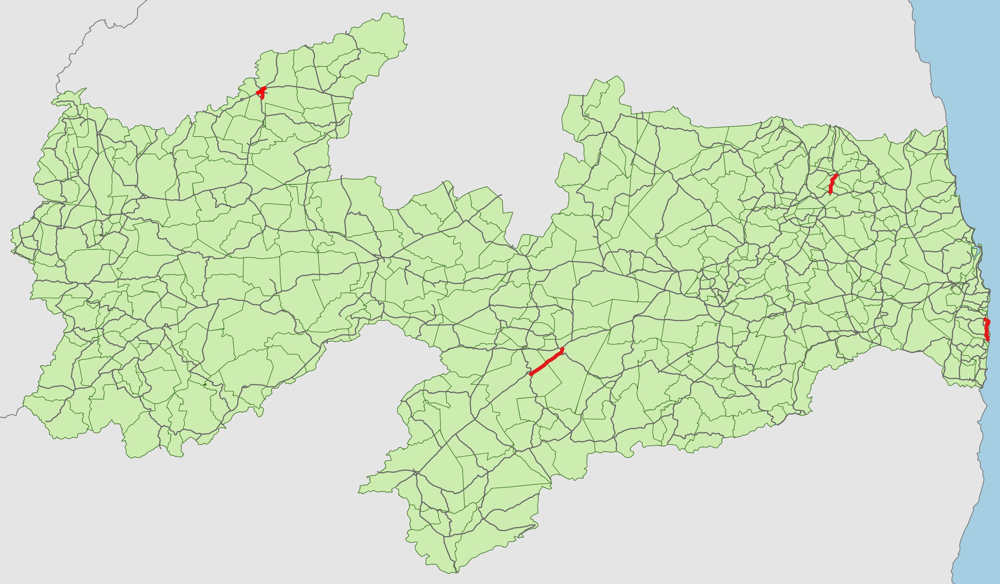


### [ST_Touches](https://postgis.net/docs/ST_Touches.html)

Compara se duas geometrias se tocam em seus limites, mas não se cruzam em seus interiores.

<div align=center>
  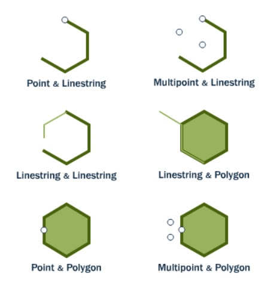
</div>


```sql
-- Quais são os municípios que fazem fronteira com Campina Grande?
SELECT a.id, a.nome
FROM municipios a,
     municipios b
WHERE ST_Touches(a.geom, b.geom)
  AND b.nome = 'Campina Grande';
```

```
 id  |         nome
-----+----------------------
   4 | Boqueirão
   9 | Lagoa Seca
  16 | Queimadas
  48 | Boa Vista
  61 | Caturité
 147 | Puxinanã
 159 | Fagundes
 164 | Ingá
 176 | Massaranduba
 203 | Riachão do Bacamarte
 192 | Pocinhos

```

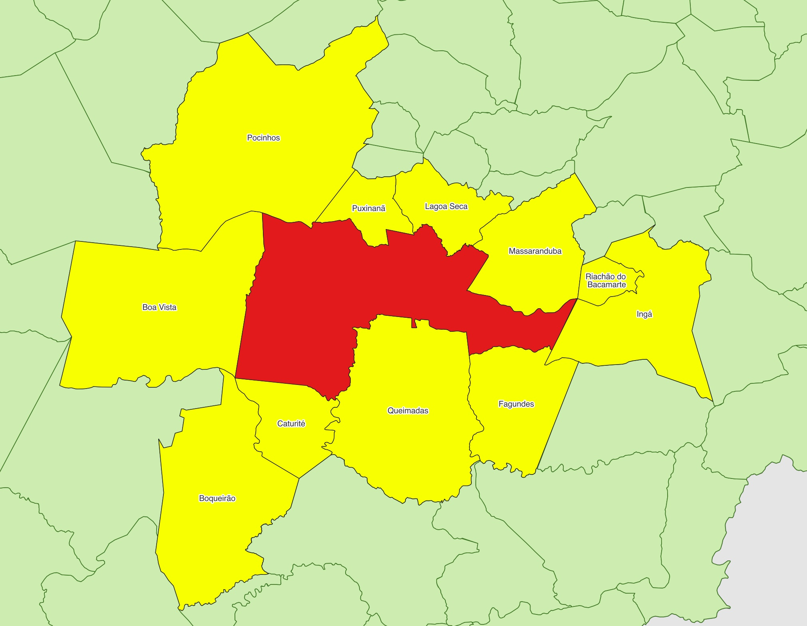

### [ST_Contains](https://postgis.net/docs/ST_Contains.html) e [ST_Within](https://postgis.net/docs/ST_Within.html)

`ST_Contains` e `ST_Within` testam se uma geometria está totalmente dentro da outra. O que muda de uma função para a outra, é o contexto da análise.

<div align=center>
  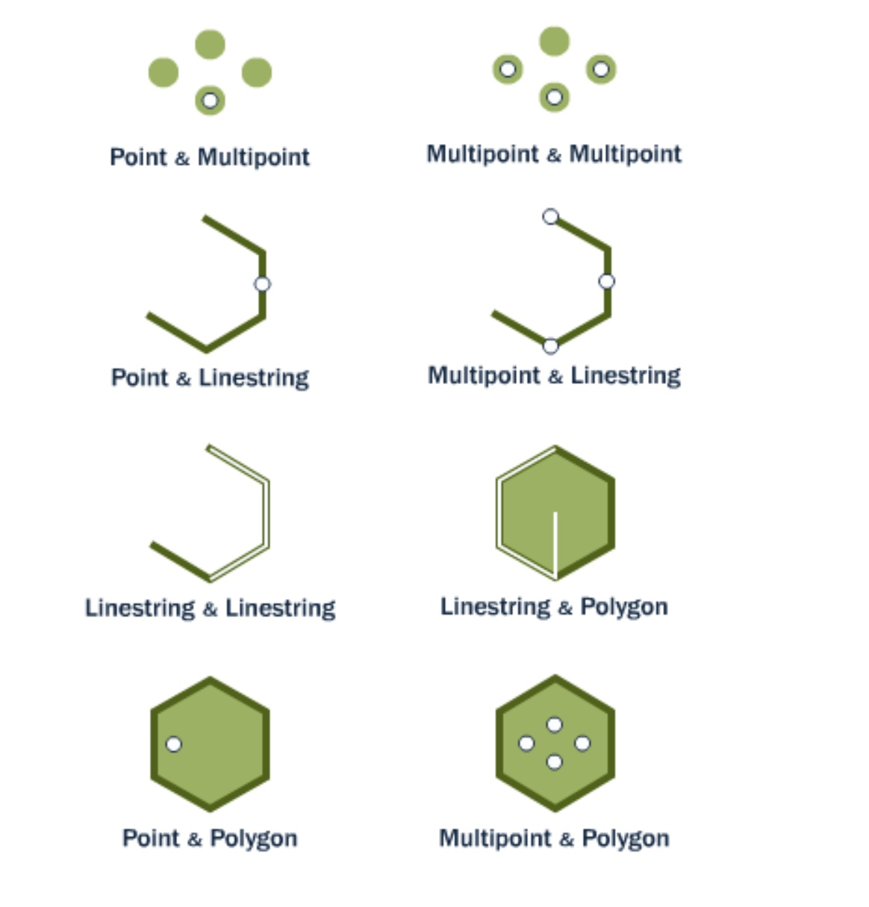
</div>

```sql
-- Quantos poços estão localizados dentro da microrregião do "Cariri Ocidental"?
SELECT m.microregiao, COUNT(p.*) AS total_pocos
FROM pocos p,
     municipios m
WHERE ST_Within(p.geom, m.geom)
  AND m.microregiao = 'Cariri Ocidental'
GROUP BY microregiao
```

```
   microregiao    | total_pocos
------------------+-------------
 Cariri Ocidental |         332
```

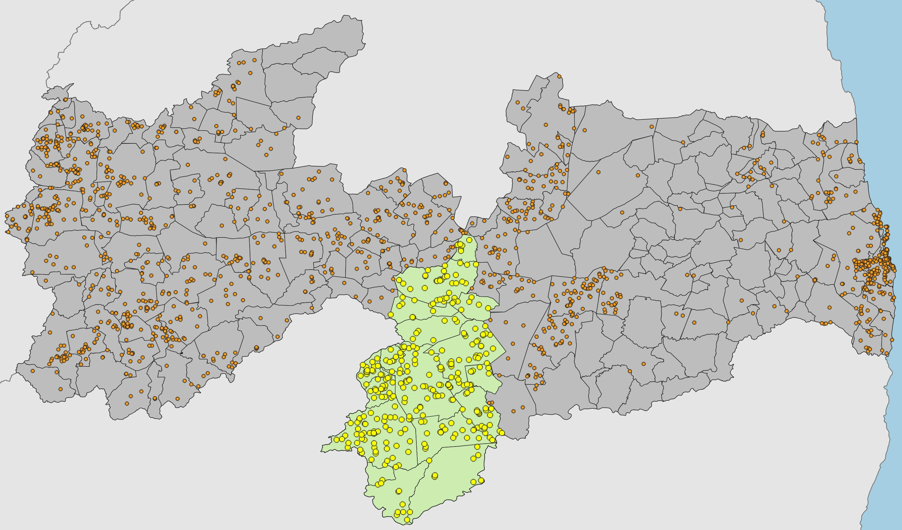

```sql
/* Qual é a soma total do campo "DensidPop" (Densidade Populacional)
de todos os polígonos da tabela densidade_pb que estão dentro do
município de João Pessoa? */
SELECT m.nome, 
       SUM(d."DensidPop") AS soma_densidade_populacional
FROM densidade_pb d,
     municipios m
WHERE ST_Contains(m.geom, d.geom)
  AND m.nome = 'João Pessoa'
GROUP BY m.nome;
```

```
    nome     | soma_densidade_populacional
-------------+-----------------------------
 João Pessoa | 9512410.090000002
```


### [ST_DWithin](https://postgis.net/docs/ST_DWithin.html)

Calcula os registros que estão a uma distância especificada.

<div align=center>
  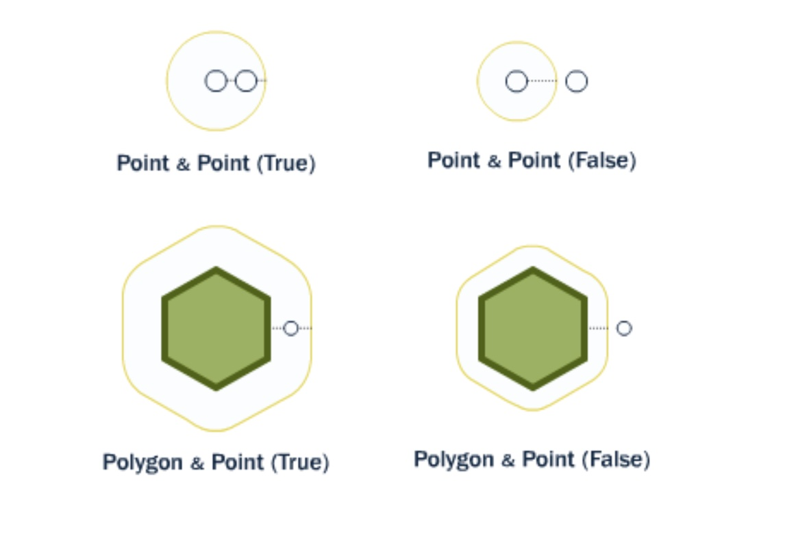
</div>


```sql
/* Retorne as coordenadas e as distâncias de todos os poços que estão a uma distância de 10 km 
da sede de Piancó, ordenados da menor para a maior distância */
SELECT p.id,
       ST_X(p.geom) AS longitude,
       ST_Y(p.geom) AS latitude,
       ST_Distance(
            s.geom::geography,
            p.geom::geography
        ) / 1000 AS distancia_km
FROM pocos p,
     sedes s
WHERE ST_DWithin(s.geom::geography, p.geom::geography, 10000)
  AND s.nome = 'Piancó'
ORDER BY distancia_km;
```

```
  id  |     longitude     |     latitude      |    distancia_km
------+-------------------+-------------------+--------------------
  867 | -37.9342299967013 | -7.20401807371753 |      0.90092213921
  827 | -37.9253409238215 | -7.21068513179489 |      0.97264929161
  866 | -37.9420080710579 | -7.21235113221429 |      2.07799676273
  835 |  -37.953119171486 | -7.21651815606339 |      3.36804628425
  860 | -37.9183968185254 | -7.15096267582719 |      5.70631125172
  830 | -37.8711734282518 | -7.18262895545261 |      6.45690143789
 1354 | -37.9547852148656 | -7.25485145040088 |  6.640799657520001
 1353 | -37.9670082444243 |  -7.1512396419904 | 7.1849956935199994
  864 |  -37.851729258835 | -7.18401798060996 |      8.47598381505
  833 | -37.9578412552455 | -7.27290758726402 |  8.584179029749999
  834 | -37.9497850679299 |  -7.1165173865415 |      9.79626468362
```

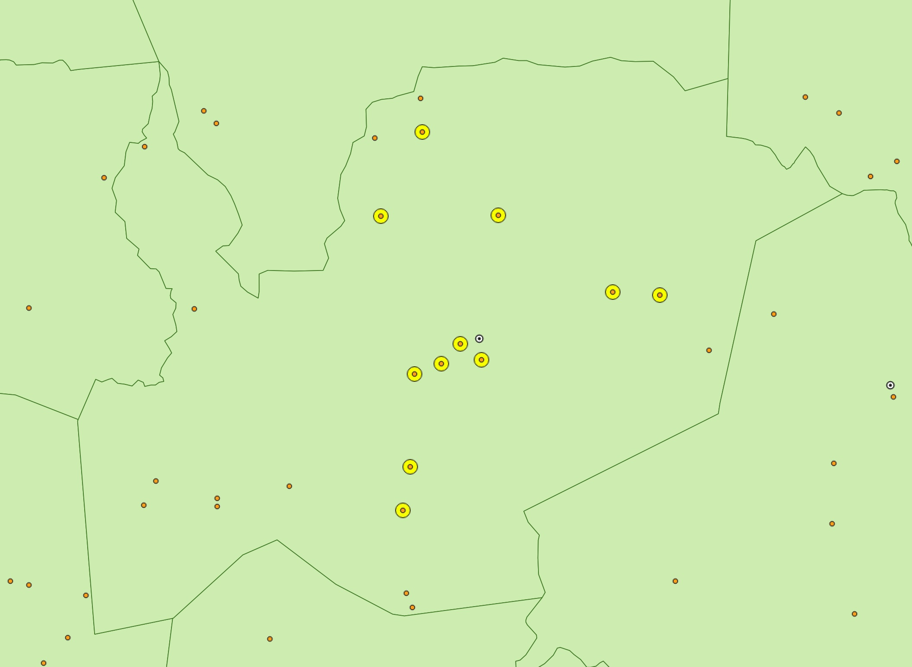

### Exercícios:

1. Quais são os rios que intersectam o município de Campina Grande?
2. Quais são os municípios que **não** fazem fronteira com o município de Patos?
3. Quais são os municípios que fazem fronteira com o município de João Pessoa?
4. Quais são os poços que estão dentro do município de Pombal?
5. Quais são os poços que estão a 15 km da sede de Patos? Ordene o resultado pela distância.
6. Quais são os municípios que intersectam a PB-008? 
7. Quanto é a soma total dos comprimentos dos rios que estão contidos pela microrregião do Agreste Paraibano?
8. Qual é a densidade populacional dos setores censitários que são cruzados pelo Rio Paraíba? 