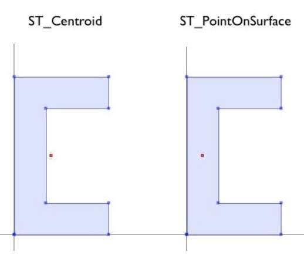
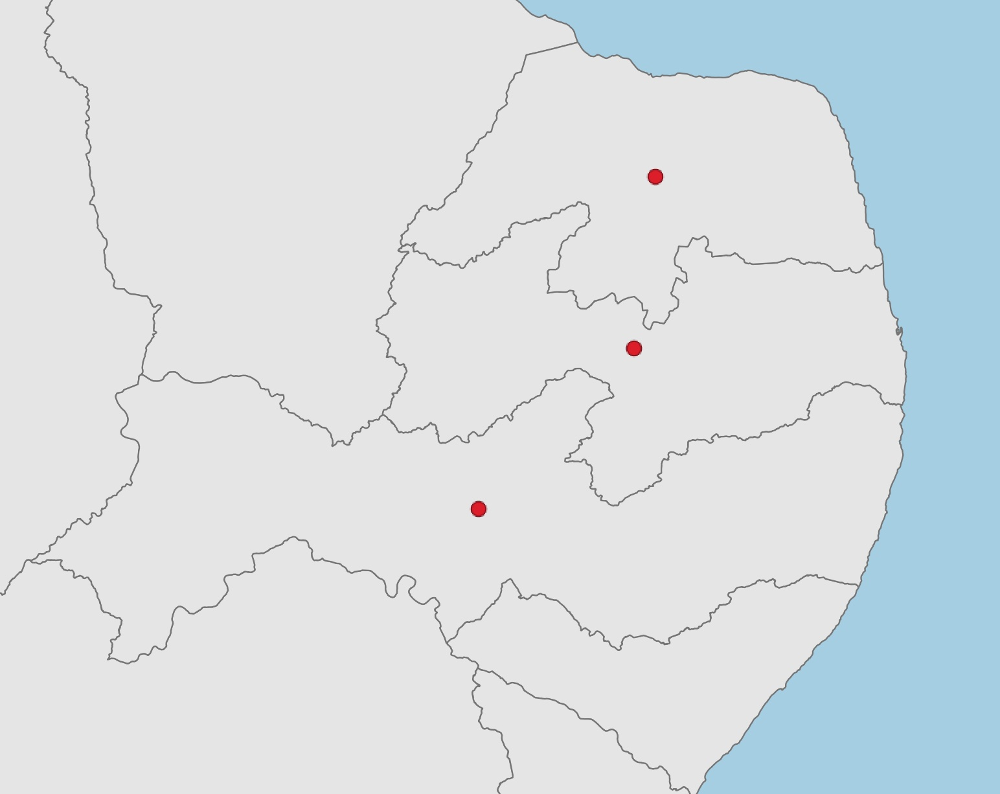
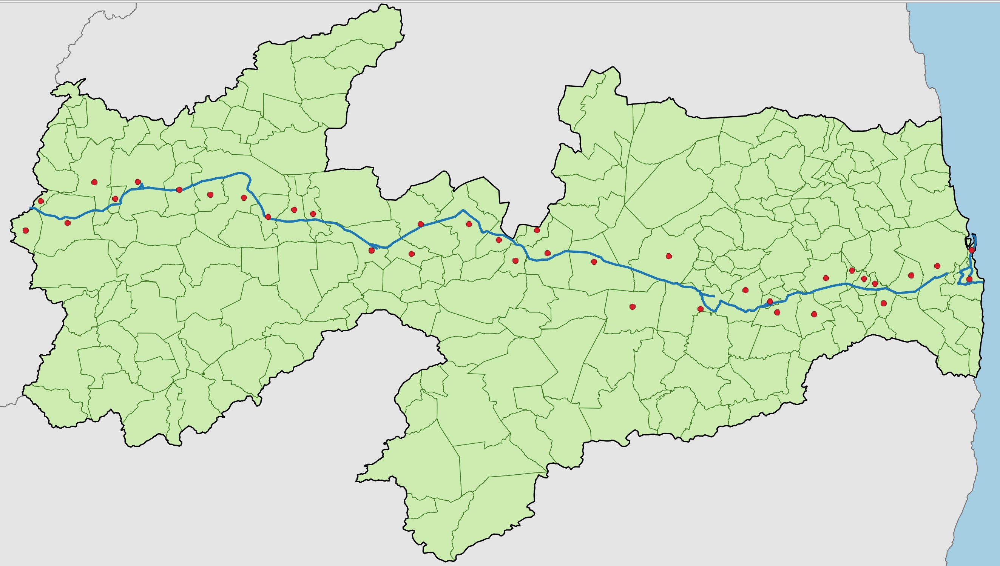
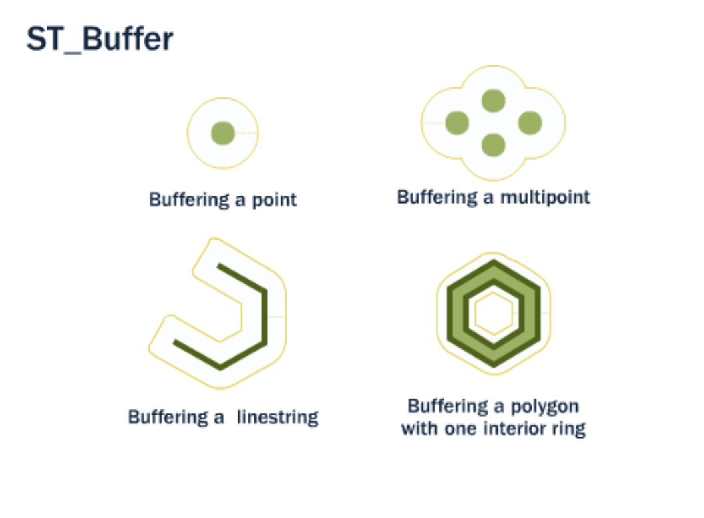
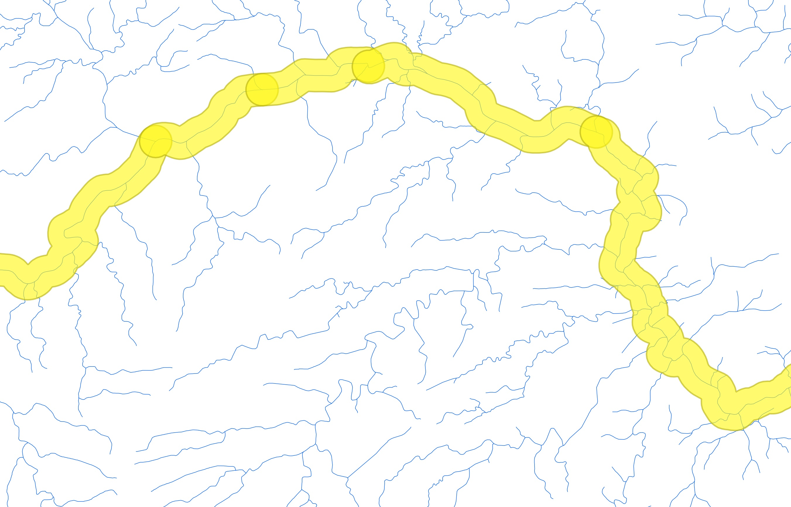
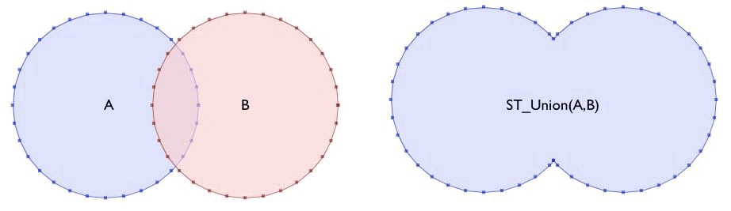
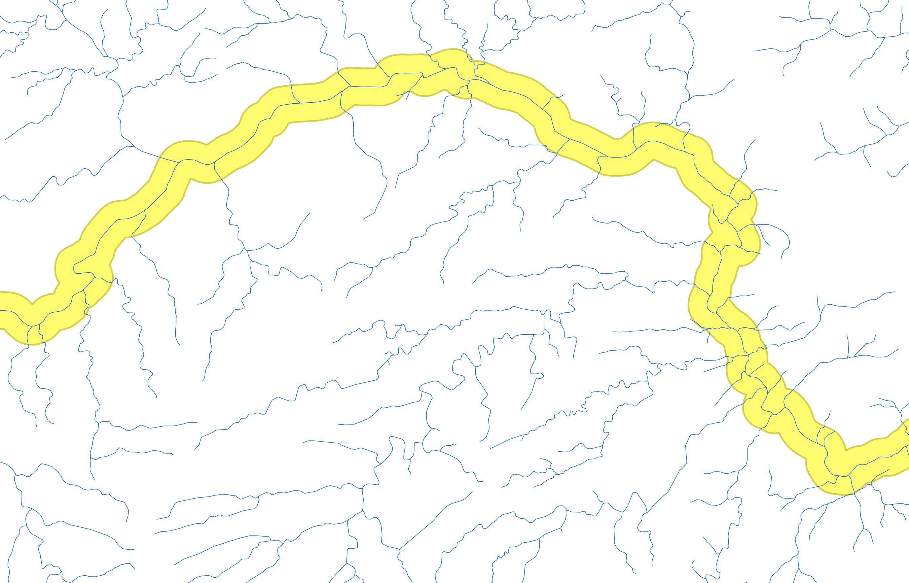
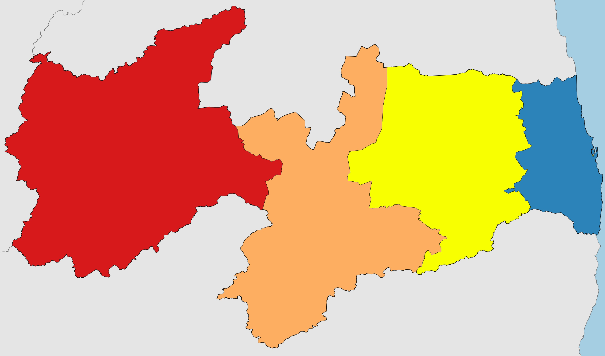
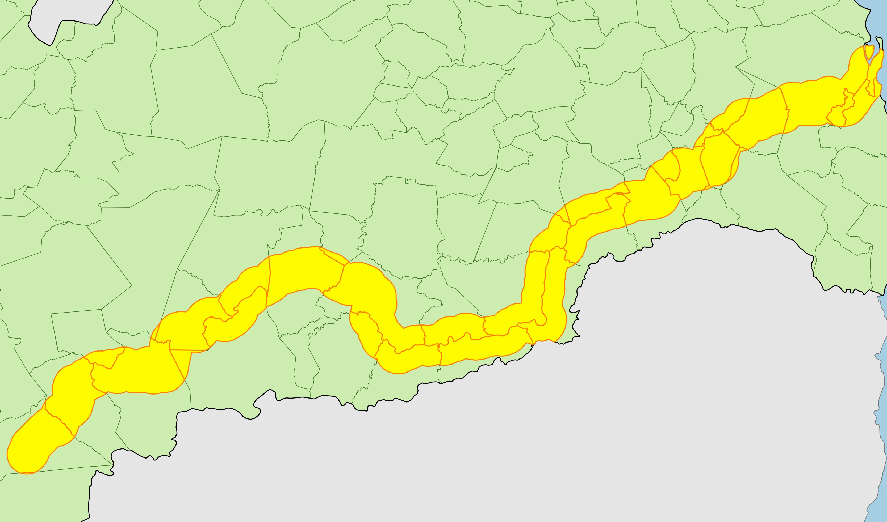
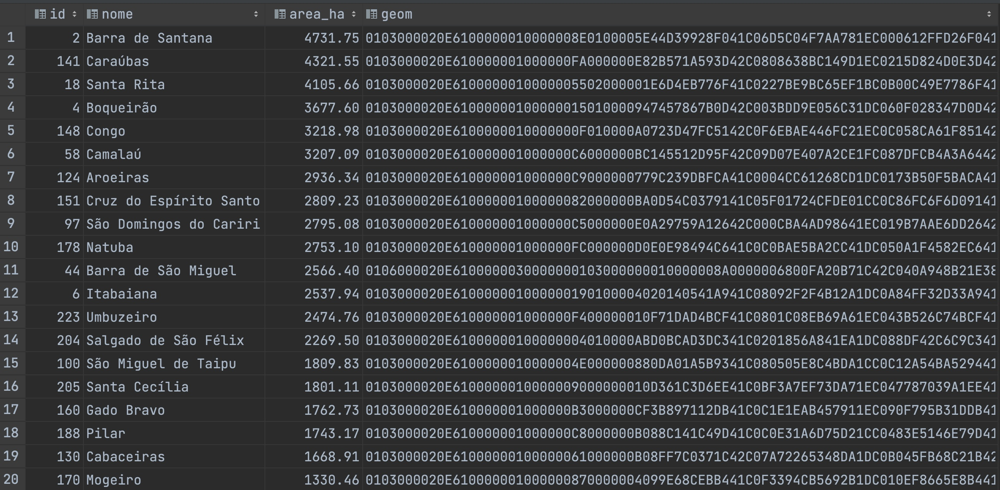

## 9. Funções que Geram Novas Geometrias

As funções de construção de geometria permitem a criação de objetos geométricos, como pontos, linhas e polígonos. Nesta seção iremos explorar o uso das principais funções que se destinam a esse propósito.

### [ST_Centroid](https://postgis.net/docs/ST_Centroid.html) / [ST_PointOnSurface](https://postgis.net/docs/ST_PointOnSurface.html)

<div align=center>

</div>

A função `ST_Centroid` é usada para calcular o centróide (ou centro de massa) de um objeto geométrico. É importante ressaltar que o centróide não precisa estar localizado dentro do objeto geométrico em si.

```sql
-- Gere os centróides dos estados de Pernambuco, Paraíba e Rio Grande do Norte.
SELECT id, ST_Centroid(geom) AS geom
FROM estados_ne
WHERE abreviacao IN ('PE','PB','RN');
```

```
 id |                        geom
----+----------------------------------------------------
  5 | 0101000020E61000006133218C8C6A42C042214058F27B1CC0
  7 | 0101000020E6100000014A7A7B345642C06DE34150D45B17C0
  9 | 0101000020E6100000FA193B76CCFF42C025BEED1FF2A620C0
```



Já a função `ST_PointOnSurface` gera um ponto central aproximado de uma geometria. Com esta função, é possível, por exemplo, encontrar um ponto que esteja dentro de um polígono e que possa ser usado como uma localização central para o mesmo.

```sql
-- Gere um ponto dentro da superfície para cada município por onde passa a BR-230.

SELECT DISTINCT a.id, a.nome, st_pointonsurface(a.geom) AS geom
FROM municipios a,
     malha_viaria b
WHERE ST_Intersects(b.geom, a.geom)
AND b.rodovia_nome = 'BR-230';
```

```
 id  |           nome           |                        geom
-----+--------------------------+----------------------------------------------------
   5 | Campina Grande           | 0101000020E61000003C481839B2F941C0E017409410151DC0
   8 | João Pessoa              | 0101000020E61000006E88200D326D41C0008ADF8F4F991CC0
  11 | Marizópolis              | 0101000020E6100000DF8BEA8E4F2B43C060321AC25E491BC0
  18 | Santa Rita               | 0101000020E6100000EAB0512AEE7D41C080E86654ED611CC0
  28 | Malta                    | 0101000020E610000083EF809EF7C342C0806E49C149881BC0
  38 | São João do Rio do Peixe | 0101000020E61000009AC5C94F1D3643C00013C5AC1C031BC0
  41 | Aparecida                | 0101000020E61000007CE923EDBA0943C0200B50A017221BC0
  ...
```



### [ST_Buffer](https://postgis.net/docs/ST_Buffer.html)

Gera uma área de influência ao redor de um objeto geométrico. A área de influência é criada por meio da expansão do objeto em uma determinada distância, especificada em unidades de medida.

<div align=center>

</div>


```sql
-- Gere um buffer de 1 km em torno dos trechos do rio Paraíba.
SELECT id, ST_Buffer(geom::GEOGRAPHY, 1000)::GEOMETRY AS geom
FROM drenagem
WHERE nome = 'Rio Paraíba';
```

```
 id   |                        geom
------+--------------------------------------------------------
31099 | 0103000020E6100000010000009F040000758E1BDCE10042C0F20B
30654 | 0103000020E610000001000000990000001DB620A95FC741C0FE7D
30653 | 0103000020E610000001000000F200000036AEE504420F42C0C02C
...
```



💡 A **unidade** do raio de influência do buffer é definida em função do **SRID** da tabela, neste caso do exemplo, os dados estão em coordenadas geográficas (SRID=4326). Então é utilizado o recurso do **casting** para `GEOGRAPHY`, e assim poder especificar a distância em metros e em seguida, o casting para `GEOMETRY`, para poder realizar análises topológicas com outras tabelas, caso seja necessário.

### [ST_Union](https://postgis.net/docs/ST_Union.html)

Permite combinar dois ou mais objetos geométricos em um único objeto geométrico, que representa a união ou agregação dos objetos originais.

<div align=center>

</div>

```sql
-- Repetir a consulta anterior, porém gerando primeiro a união dos trechos que compõem o rio Paraíba.
WITH rio_paraiba_union AS (
    SELECT ST_Union(geom) AS geom
    FROM drenagem
    WHERE nome = 'Rio Paraíba'
)
SELECT ROW_NUMBER() OVER ()::int AS id,
       ST_Buffer(geom::geography, 1000)::geometry AS geom
FROM rio_paraiba_union;
```

```
 id |                        geom
----+--------------------------------------------------------
  1 | 0103000020E61000000100000047170000847BA218E26242C0880C1
```




```sql
-- crie os polígonos das mesorregiões a partir do campo 'mesoregiao' da tabela municipios.
SELECT ROW_NUMBER() OVER ()::int AS id,
       mesoregiao,
       ST_Union(geom) AS geom
FROM municipios
GROUP BY mesoregiao;
```



### ST_Intersection

Calcula a interseção entre duas geometrias. O resultado da função é uma nova geometria que representa a área de interseção entre os dois objetos.

<div align=center>

</div>

```sql
/* Calcule a área de interseção entre o buffer do Rio Paraíba e os municípios. 
Calcule também a área recortada em hectares de cada município e ordene 
o resultado da maior para a menor área. */
SELECT m.id,
       m.nome,
       (ST_Area(ST_Intersection(m.geom, b.geom)::geography) / 50000)::numeric(10, 2) AS area_ha,
       ST_Intersection(m.geom, b.geom) AS geom
FROM municipios m, (
        SELECT ST_Buffer(ST_Union(geom)::geography, 5000)::geometry AS geom
        FROM drenagem
        WHERE nome = 'Rio Paraíba'
) AS b
WHERE ST_Intersects(m.geom, b.geom)
ORDER BY area_ha DESC;
```





### Exercícios:

1. Gere centróides para os municípios da microrregião do Piancó.
2. Gere pontos na superfície para os polígonos da camada `densidade_pb` que estão localizados na mesorregião do Sertão Paraibano.
3. Crie um buffer de 2km para a rodovia BR-230.
4. Repita o procedimento anterior, unindo antes os trechos de rodovia.
5. Calcule a área de interseção entre o buffer da rodovia BR-230 e os municípios. Adicione a consulta o valor da área recortada em hectares de cada município e ordene o resultado da maior para a menor área.
